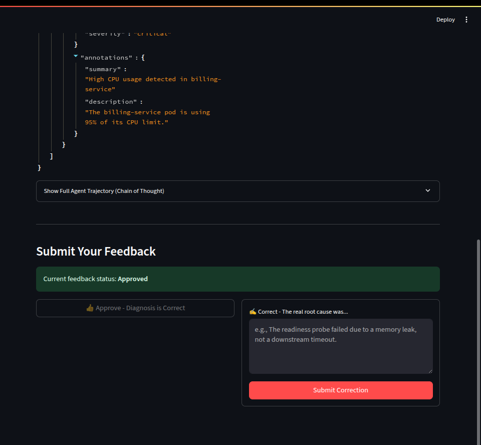

# AIDA: The Autonomous Incident Diagnostic Agent 🤖

AIDA (Autonomous Incident Diagnostic Agent) is a state-of-the-art MLOps project that demonstrates a complete, end-to-end system for an AI agent that acts as a junior Site Reliability Engineer (SRE).

When a production alert fires, AIDA is automatically dispatched to investigate. It uses a suite of tools and a RAG-based knowledge system to diagnose the problem, proposes a root cause, and crucially, learns from human feedback to improve its performance over time via an automated fine-tuning pipeline.

## Key Features

- **⚡ Dual LLM Engine:** Seamlessly switch between a powerful cloud-based model (`OpenAI GPT-4o`) for maximum reasoning capability and a self-hosted, fine-tuned model (`Google Gemma-2B`) for a private, cost-effective, and specialized solution.
- **🧠 Full MLOps Loop:** Implements a complete machine learning lifecycle. AIDA's investigations are reviewed by a human expert, and this feedback is used to generate a training dataset to automatically fine-tune and improve the agent.
- **🤖 Autonomous Agent:** A sophisticated agent built with LangChain that can reason, plan, and use a "Tool Belt" to interact with its environment (Kubernetes, Prometheus, etc.).
- **📚 RAG-Powered Knowledge:** AIDA consults a knowledge base of technical runbooks stored in a ChromaDB vector database, ensuring its diagnostic steps are grounded in best practices.
- **🔧 Production-Grade Infrastructure:** The entire system is containerized with Docker Compose, featuring a robust, event-driven architecture with a FastAPI webhook, Redis job queue, and a persistent PostgreSQL backend for MLflow.
- **☁️ Hybrid Cloud Fine-Tuning:** A pragmatic training pipeline that exports human-validated data from the local environment to be fine-tuned on a high-powered cloud GPU (like a Google Colab A100), with the resulting model deployed back to the local agent.

## System Architecture

AIDA is a multi-component, event-driven system designed for robustness and scalability. The architecture is designed as a hybrid model, with core services running locally while the intensive model training process is offloaded to the cloud.


## MLOps Lifecycle in Action

This project demonstrates a complete, closed-loop MLOps cycle.

#### 1. An Alert Fires & Investigation Begins

An incident is triggered via a `curl` command simulating Prometheus. The AIDA agent picks up the job, loads its self-hosted, fine-tuned Gemma-2B model, and begins its investigation. Every action is logged as a new "Run" in MLflow.


#### 2. AIDA Investigates and Concludes

The agent uses its tools to gather data and formulates a conclusion. All generated artifacts, including the raw alert and the agent's final report, are logged to MLflow for full traceability.


#### 3. Human Review in the Feedback Console

A human engineer opens the Feedback Console to review the case. They can see the initial alert and AIDA's final conclusion side-by-side, providing a clear and efficient overview for validation.


#### 4. Providing Corrective Feedback

The engineer provides feedback, creating a high-quality data point that associates the agent's trajectory with a correct, human-validated answer. This feedback is saved back to the MLflow run, and the UI updates to reflect the new status.



#### 5. Training the Next-Generation Model

The `export_data.py` script gathers all such validated runs. This dataset is then used in the Google Colab notebook to fine-tune the model, creating a new, smarter adapter. This completes the learning loop, and the improved model is ready for deployment.

## Technology Stack

| Category                    | Technology                                                                                                |
| --------------------------- | --------------------------------------------------------------------------------------------------------- |
| **AI & Machine Learning**   | `LangChain`, `Hugging Face (Transformers, PEFT, TRL)`, `Sentence-Transformers`, `PyTorch`, `bitsandbytes` |
| **LLM Engine**              | `OpenAI API (GPT-4o)` and/or self-hosted fine-tuned `Google Gemma-2B`                                     |
| **MLOps & Experimenting**   | `MLflow`                                                                                                  |
| **Backend & API**           | `Python 3.11`, `FastAPI`, `Redis`                                                                         |
| **Frontend & UI**           | `Streamlit`                                                                                               |
| **Databases**               | `PostgreSQL` (for MLflow), `ChromaDB` (Vector Store), `Redis` (Queue)                                     |
| **DevOps & Infrastructure** | `Docker`, `Docker Compose`, `NVIDIA Container Toolkit`                                                    |

## Project Structure

```bash
AIDA/
├── aida_agent/
│ ├── training/
│ │ ├── aida-gemma-2b-sre-adapter-v1/ # Fine-tuned model adapter
│ │ ├── AIDA_Fine_Tuning.ipynb # Colab notebook for training
│ │ └── export_data.py # Script to export training data
│ ├── Dockerfile
│ ├── agent.py
│ ├── entrypoint.sh
│ ├── ingest.py
│ ├── requirements.txt
│ └── tools.py
├── docs/
│ ├── AIDA_architecture.png
│ └── screenshots/
├── feedback_ui/
├── runbooks/
├── webhook_api/
├── .env
├── .gitignore
├── docker-compose.yml
├── huggingface_token.txt
└── Mlflow.Dockerfile
```

## Setup and Usage

### Prerequisites

1.  **Docker & Docker Compose:** Ensure they are installed on your system.
2.  **NVIDIA GPU & Drivers:** A CUDA-enabled NVIDIA GPU is required for the self-hosted model.
3.  **NVIDIA Container Toolkit:** Must be installed and configured to grant Docker access to the GPU.

### Configuration

1.  **`.env` File:** Create a `.env` file in the project root and add your OpenAI API key (this is optional if you only plan to use the local model).
    ```
    OPENAI_API_KEY="sk-..."
    ```
2.  **Hugging Face Secret:** Create a file named `huggingface_token.txt` in the project root. Paste your Hugging Face access token into this file. This is required to download the Gemma-2B model.
    - Add this file to your `.gitignore`: `echo "huggingface_token.txt" >> .gitignore`.

### Running the System

1.  **Create External Volume:** The PostgreSQL database requires an external volume to ensure its data persists. Create it once with:

    ```bash
    docker volume create aida_postgres_data
    ```

2.  **Build and Start:** Perform a clean build and start all services. This will take a very long time on the first run as it downloads the large NVIDIA CUDA base image and all Python dependencies.

    ```bash
    # It is highly recommended to use --no-cache on the first build
    docker compose build --no-cache
    docker compose up -d
    ```

3.  **Populate the Knowledge Base:** Execute the ingestion script to process the runbooks into the vector database.
    ```bash
    docker compose exec aida_agent python3 ingest.py
    ```

### Switching Between Models

You can easily switch between your self-hosted model and the OpenAI API.

1.  Open `docker-compose.yml`.
2.  Find the `aida_agent` service.
3.  Change the `USE_LOCAL_MODEL` environment variable:
    - `USE_LOCAL_MODEL=true` to use your fine-tuned Gemma-2B model.
    - `USE_LOCAL_MODEL=false` to use the OpenAI API.
4.  Restart the stack: `docker compose up -d --build` (a build is needed to copy any code changes).
